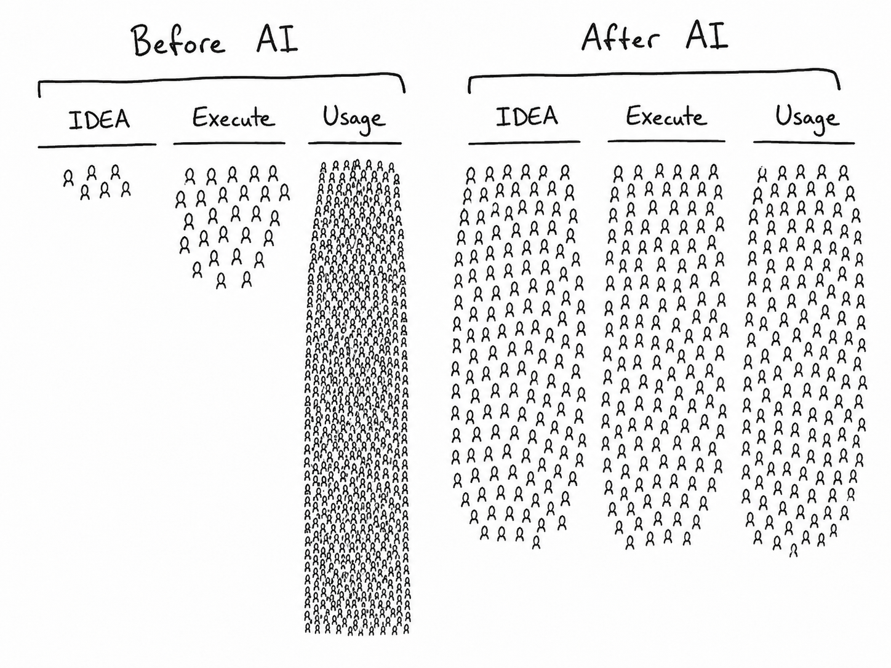

# axm-aide



**A sovereign personal assistant whose memory has custody and whose judgment is surrendered.**

axm-aide journals, tracks tasks, and records agent work sessions as genesis-sealed shards — detached-verifiable forever — makes them queryable, and **proposes actions it never executes**. A proposal is a sealed record that requires a human disposition through the ecosystem's review flow. The aide keeps custody of your memory. It surrenders the decision.

---

## The thesis

Before AI, a few people *ideate*, some *execute*, and everyone *uses*. After AI, the tooling lets everyone do all three — ideate, execute, and use — at once. That collapse is the opportunity and the danger. An assistant that can execute is an assistant that can act without you. axm-aide takes the opposite stance: it will remember everything, structure it, and surface it, but it will not act. Every action it can imagine is written down as a **proposal** and handed to a human.

## What it is

Three record kinds, each sealed as its own signed [Genesis v1](https://github.com/BigBirdReturns/axm-genesis) shard. Every claim is bound to the exact bytes it came from; every shard verifies offline against an out-of-band publisher key.

| Kind | Namespace | What it holds |
|---|---|---|
| **Journal** | `aide/journal` | An entry, sealed verbatim, plus caller-supplied tags. `recorded_at` (tier 0), one `tagged` claim per caller tag (tier 1). |
| **Task** | `aide/task` | `has_title`, `declared_status` (`open`/`done`/`dropped`), optional `due` — all tier 0, caller-declared. |
| **Session** | `aide/session` | What an agent work session read, produced, and **proposed**. Each proposal `requires_disposition "human"`, sealed verbatim. |

## The gate (doctrine)

- **Custody is genesis's.** The aide never mints a shard id — the kernel derives `sh1_…` from the sealed manifest bytes. One custody model, no second.
- **No interpretation without a gate.** Tags and statuses are *caller-supplied*, never inferred. A journal entry with no tags produces zero `tagged` claims. The aide summarizes nothing into a claim.
- **The machine never decides.** A proposal is a sealed record, not an action. It carries no authority. Execution is downstream of a **human disposition** — `escalate`, `dismiss`, or `needs_context`. There is no `approve` / `true` vocabulary anywhere in the surface.
- **Append-only history.** A task's current status is the `declared_status` from the shard with the latest `created_at`. A status change is a *new* shard; a sealed shard is never rewritten.

## Quick start

```bash
# Seal a journal entry (tags are yours; nothing is inferred)
axm-aide journal "Realized the aide should never summarize" --tag insight --tag doctrine

# Track a task
axm-aide task add "Ship axm-aide v0" --due 2026-07-15
axm-aide task list
axm-aide task done <task_id>          # a NEW shard; the original is never rewritten

# Record what an agent session did — and what it PROPOSES (never executes)
axm-aide session record \
  --read sh1_… --produced sh1_… \
  --propose "Email the quarterly report to finance"

# The morning read: open tasks, recent journal, pending proposals
axm-aide brief

# Verify any shard against the out-of-band publisher key (exit 0 pass / 1 fail / 2 no anchor)
axm-aide verify
```

Shards live in `~/.axm/shards/aide_*`; the publisher key pool is `~/.axm/keys` (`publisher.sk` 3904 B, `publisher.pub` 1344 B — the single v1 suite `axm-hybrid1`, Ed25519 ‖ ML-DSA-44, both must verify). `brief` and `verify` anchor to an **out-of-band** key (`--trusted-key`, default `~/.axm/keys/publisher.pub`) — never a shard's own embedded key.

Registered as an `axm.spokes` plugin, so with axm-core installed the same verbs run under `axm aide …`.

## Install

```bash
pip install -e ../axm-core      # SpectraEngine, needed for `brief`
pip install -e .                # the aide
# seal-only (no query runtime): pip install -e '.[minimal]'
```

The seal path (journal / task / session / verify) needs only the genesis kernel. `brief` mounts shards into axm-core's SpectraEngine and exits with an install hint if axm-core is absent.

## Honest evidence tier

Every aide shard carries `content/aide_manifest.json`:

> **`agent_record`** — caller-declared statements, sealed and verifiable; nothing here is a verified fact about the world.

Limits, stamped with the bytes: caller-declared statements only; not verified facts about the world; tags are caller-supplied, never inferred; proposals confer no authority to act (execution requires a human disposition); not platform truth.

## The loop

axm-aide is the spoke a scheduled agent session writes to: read the brief → do the work → `aide session record` the reads, produces, and proposals → a human reviews and dispositions via the console. See [docs/LOOP.md](docs/LOOP.md).

## License

Apache-2.0. Part of the AXM ecosystem. This spoke imports the genesis kernel (`axm_build` / `axm_verify`) and axm-core's `axiom_runtime` — the documented spoke privilege — and nothing else from any sibling.

## Licensing note

The repository code is Apache-2.0 (see LICENSE). Sealed shards stamp
`LicenseRef-AXM-Personal` in their manifests: your journal, tasks, and session
records are personal records, not redistributable code.
